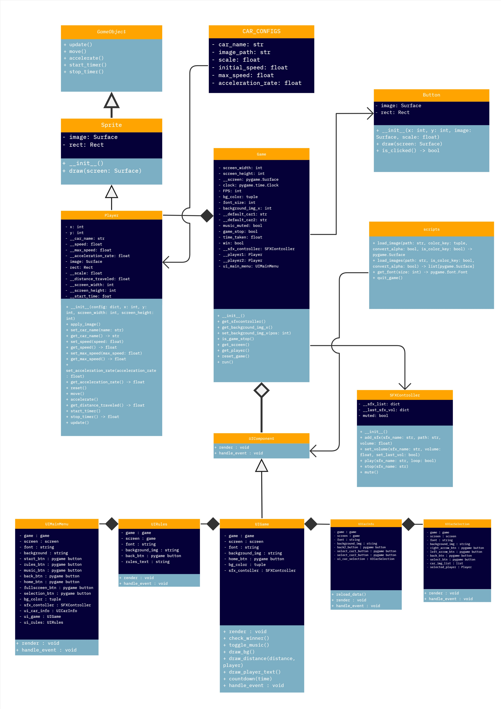

<div align="center">

<h1> Diesel Drag Race by RB-03 </h1>

Diesel Drag Race: The Exciting Pixel Art Racing Game created by RB-03.

[](#)
[](#)
[](#)
</div>

# Table of Content
[Introduction of The Game](#Diesel-Drag-Race) <br>
[UML Diagram](#Uml-Diagram) <br>
[Contributors](#Team-Members) <br>
[Installation Steps](#Installation-Steps) <br>
[Running the Game with Python](#Run-The-Game) <br>


## DIESEL DRAG RACE
<div align="justify">
<p>In Diesel Drag Race, players will engage in exciting, adrenaline-pumping races. At the start of the game, a tense moment comes when the countdown starts before their car is released onto the track. With easy-to-understand controls via special buttons on the keyboard, players will try to accelerate their car as quickly as possible. The race will continue until one of the cars reaches the finish line at a certain distance. With eye-catching graphics and fast-paced racing action, Diesel Drag Race offers a fun and thrilling gaming experience every time players race their cars on the track.</p>
</div>

## UML Diagram
<div align="center">

<p>Here is the UML Diagram</p>
</div>

## Team Members
<div align="center">

|   **NAMA**|**NIM**   | **KONTRIBUSI**  |**GITHUB**|
| ------------ | ------------ | ------------ | ------------ | 
| Dinda Joycehana | 122140048  | Programmer, UML Design  | [@dindajoycehana](https://github.com/dindajoycehana)|
| Fathan Andi Kartagama | 122140055   |Programmer, Project Handler    |[@pataanggs](https://github.com/pataanggs)|
| Hagai Kopusi Sinulingga  | 122140059  | Programmer, UML Desig  |[@Hagaikopusi](https://github.com/Hagaikopusi)|
| Rahmat Aldi Nasda | 122140079 | Programmer, 2D Artist|  [@urbaee](https://github.com/urbaee)|
| Chandra Budi Wijaya  | 122140093  | Project Leader, Programmer  | [@ChandraBudiWijaya](https://github.com/ChandraBudiWijaya)|

</div>

## Installation Steps
<li> Install Python 3.12 or higher</li>
<li> Install python-pip or python3-pip</li>
<li> Install pygame</li>

Open terminal where you want to clone the repository and run the following command:
```
git clone https://github.com/urbaee/Diesel-Drag-Race.git
cd Diesel-Drag-Race
```
Run the following command to install pygame:
**Install Pygame for Windows User**
```
py -m pip install -U pygame --user
```
**Install Pygame for MacOs User**
```
python3 -m pip install -U pygame --user
```
**Install Pygame for DEBIAN/UBUNTU/MINT**
```
sudo apt-get install python3-pygame
```

## Run The Game
**Running Via Visual Studio Code**

Run the following command to start the game:
```
python3 main.py
```
Alternative command:
```
python main.py
```
**Running The Exe:**
1. Download the zip file from the [GitHub Releases](https://github.com/urbaee/Diesel-Drag-Race/releases).
2. Extract the contents of the zip file to a desired location on your computer.
3. Navigate to the extracted folder.
4. Double-click on the `main.exe` file to run the game.

Note: Make sure you have the necessary dependencies installed on your system.
